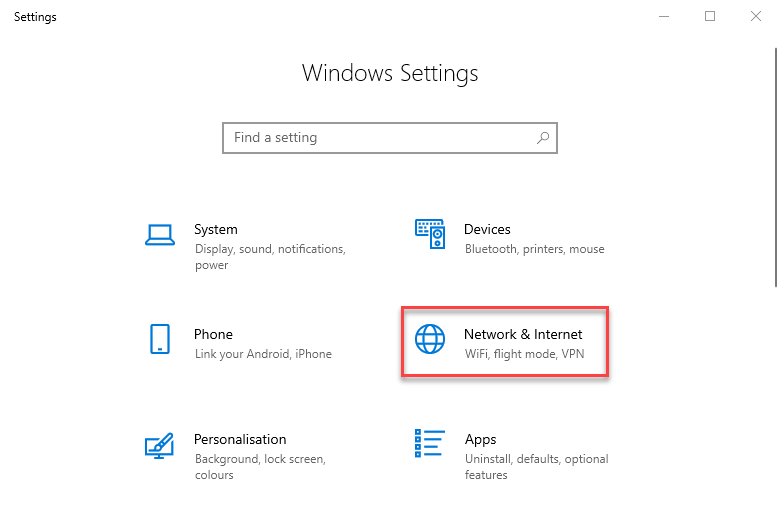
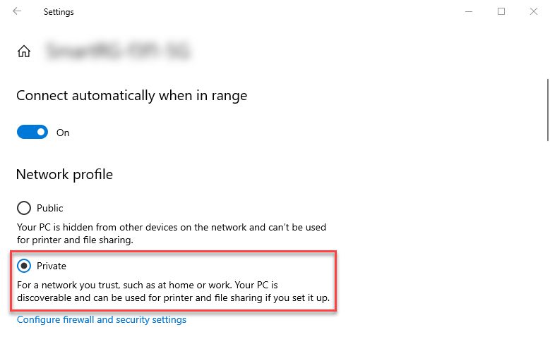

# Setting up your network and firewall

To enable a proper connection of the Live Capture apps with the Unity Editor:

-   Ensure that your client device and your Unity Editor workstation have access to the same network.

-   Disable any active VPNs.

-   On Windows 10, make sure the Wi-Fi network you are using is [set to Private](#private-wi-fi-network-setup).

-   If you still can’t connect, [configure your firewall](#firewall-rule-configuration) with a dedicated rule.

## Private Wi-Fi network setup

1.  In the Windows Settings, select **Network & Internet**.

    

2.  In the left panel, select **WiFi**, and then click on your connection on the right.

    

3.  In **Network profile**, select **Private**.

    

## Firewall rule configuration

1.  In the **Control Panel**, go to **System and Security > Windows Defender Firewall**.

2.  In the left menu, select **Advanced Settings**.

    

3.  In the left pane, first select **Inbound Rules**.

    

4.  In the right pane, select **New Rule**.

    

5.  Perform the configuration steps through the New Inbound Rule Wizard according to your needs:  

### Configuring a Program rule

Select **Next** each time to go to the next step.

| **Step**  | **Setting** |
|-----------|-------------|
| Rule Type | • Select **Program** (default). |
| Program   | • Select **This program path:** and then **Browse** to the Unity.exe file that corresponds to the Unity Editor that you want to connect the apps to. |
| Action    | • Select **Allow the connection** (default). |
| Profile   | • Select **Private** (deselect **Domain** and **Public**). |
| Name      | • Enter **Unity Live Capture**, for example. |

### Configuring a Custom rule

Select **Next** each time to go to the next step.

| **Step**  | **Setting** |
|-----------|-------------|
| Rule Type | • Select **Custom** (default). |
| Program   | • Select **This program path:** and then **Browse** to the Unity.exe file that corresponds to the Unity Editor that you want to connect the apps to. |
| Protocol and Ports | • **Protocol type**: select **TCP** or **UDP** (you need to make inbound rules for both)  • **Local port**: select **Specific Ports**, then enter **9000, 9010-9019, 12043** to allow the default ports used by Live Capture. **Note:** If you are using custom port ranges for the Live Capture server, instead enter **\<server port>, \<video server port range>, 12043**.  • **Remote port**: select **All Ports** (default). |
| Scope | • For both the **local** and **remote IP addresses**, select **Any IP address** (default). |
| Action    | • Select **Allow the connection** (default). |
| Profile   | • Select **Private** (deselect **Domain** and **Public**). |
| Name      | • Enter **Unity Live Capture**, for example. |
