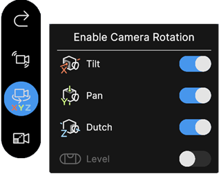
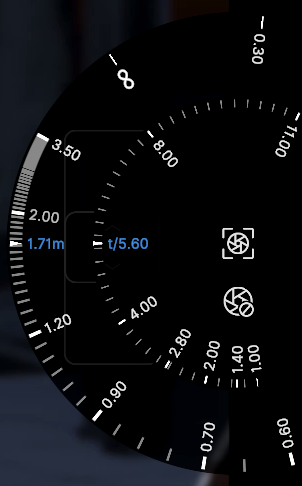
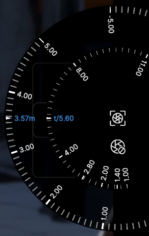
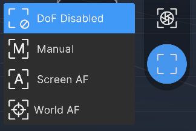
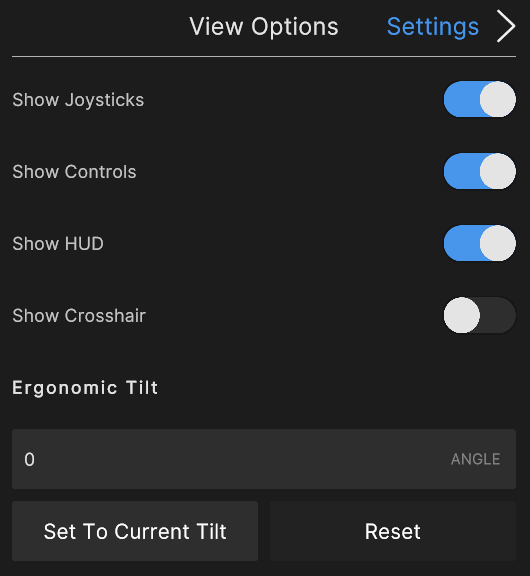
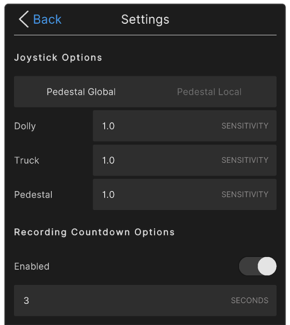

# Virtual Camera controls and settings

## Controls

### HUD

| **Field**              | **Function**                                                 |
| :--------------------- | :----------------------------------------------------------- |
| __Settings__           | Opens the [settings window](#settings) to configure view options, joystick settings, recording options, etc. |
| __Timeline__           | Shows whether or not a timeline is assigned in the **Live Capture** window |
| __Gate__               | Displays the current sensor size in mm                       |
| __Timecode__           | Displays the timecode (hr:min:sec:frame) of the current recording session or clip |
| __Focus Mode__         | Displays the current focus mode (Depth of Field Disabled, Manual Focus, Auto Focus, Spatial Focus) |
| __Focus Distance__     | Displays the current focus distance in meters. This will display "N/A" when Focus Mode is "DoF Disabled" |
| __Aperture__           | Displays the current T-stop (aperture)                       |
| __Focual Length__      | Displays the current focal length in millimeters             |
| __AR Tracking Toggle__ | Tap to enable/disable AR tracking                            |
| __Connection__         | Tap to open a connection window to connect or disconnect from a server |
| __Help__               | Tap to enter Help Mode. In Help Mode, tapping any control will display a tooltip with more information about its functionality |

### Axis rotation locking

Use the switches to lock or unlock rotation about each of the three axes (**Tilt**, **Pan**, **Roll**). This can be useful to simulate certain types of camera movement.

### Motion Scale and axis position locking

You can change the motion scale to multiply the tracked motion along a given local axis. This can be useful if there is limited physical space, or to simulate the motion from a crane or a drone.

You can also select the lock icon beside each axis icon to lock or unlock the position along this axis. For example, to simulate a tripod, lock all three axes.

### Focal Length

Change the focal length of the camera using focal length dial. Open the dial with the focal length button on the right control bar. Rotate the dial to change the value. The current focal length is displayed in the HUD under **ZOOM**.

Changing the focal length sets the distance, in millimeters, between the camera sensor and the camera lens. Lower values result in a wider Field of View, and vice versa

**Note: changing this value forces the Focus Mode to Manual.**

### Damping Settings

You can apply positional and rotational damping to the camera motion from your mobile device as well as from the server (in the Unity Editor).

| **Field**          | **Function**                                                 |
| :----------------- | :----------------------------------------------------------- |
| __Body__           | Time in seconds for the rig to reach the target position. You can set a different value on each axis. |
| __Aim__            | Time in seconds for the rig to reach the target rotation. The value you set applies to all three axes. |
| __Enabled__ | Enables or disables positional and rotational damping on all axes. |

**When you use a Cinemachine Camera Actor, the damping only applies in Play Mode.**

### Reset Pose and Lens

Pressing the **Reset Pose** button repositions the camera rig to its origin. This has no impact on the rotation of the camera.

Pressing the **Reset Lens** button resets the camera lens to its default settings.

###  Depth of Field
The depth of field can be controlled in two ways, using a manual dial, or by tapping to place a screen-space reticle.
Note that the reticle position may optionally be set from the editor as well, by clicking in the gameview.
| Dial - Manual Focus | Dial - Auto Focus | Focus Mode |
| ----- | ----- | ----- |
| |  ||

| **Mode**          | **Description**                                                 |
| :----------------- | :----------------------------------------------------------- |
| __DoF Disabled__ | Disable Depth of Field                 |
| __Manual__      | In this mode, tapping the screen will set the focus distance to the point under the placed reticle. **Note** setting the focus distance with the dial will automatically set the focus mode to **Manual**                                        |
| __Screen AF__  | In this mode, tapping the screen will place a persistent reticle that will constantly set the focus distance to the 3D point under the reticle. **Note** constantly calculating the focus distance under the reticle is performance intensive, so you may have to lower the quality of the video stream to maintain framerate |
| __World AF__  | In this mode, tapping the screen will select the scene object under the reticle, if any. If an object is selected, focus distance will be continually updated to match this object's distance to the camera. **Note** To be selected, an object needs to use (a) material(s) including a pass matching one of the following tags: `Forward`, `ForwardOnly`, `SRPDefaultUnlit`, `GBuffer`, `ForwardLit`, `Unlit`, `UniversalForward`. Built-in SRP and ShaderGraph materials should be covered, remember to tag one of your passes when working with custom shaders. |

When using Screen or World Auto Focus, the focus distance dial controls an offset applied to the automatically evaluated focus distance.

###  Timeline Control

If there is a Timeline assigned to in the **Live Capture** window top control panel, tap the timeline button in the botttom left to bring up a playback control radial slider. Scrub the radial slider to move through the playback.

Pressing record will automatically play the Timeline from the selected head position.

Note the playback progress bar at the top of the screen under the HUD.

## Settings

Open the settings by tapping the **Settings** button in the top left of the HUD.

### View Options

| **Option**              | **Description**                                              |
| :---------------------- | :----------------------------------------------------------- |
| __Show Joysticks__      | Toggles the visibility of the virtual joysticks              |
| __Show Controls__       | Toggles the visibility of the camera controls on the left and right of the screen |
| __Show HUD__            | Toggles the visibility of the HUD bar at the top of the screen. To re-enable, tap the screen with 3 fingers |
| __Show Crosshair__      | Toggles the visibility of a crosshair in the center of the screen to help frame shots |
| __Ergonomic Tilt__      | Tilts the device orientation relative to the virtual camera orientation to allow for a more ergonomic grip |
| __Set To Current Tilt__ | Sets the tilt according to the current orientation of your device. |
| __Reset__               | Resets the tilt to 0.                                        |

### Controls Tab

* Set if the pedestal joystick (the right joystick) moves up in global or local space
* Set the sensitivity of the joystick in each axis
